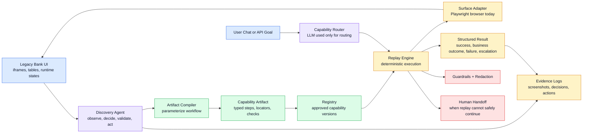

# 1. Architecture — your architecture and the key decisions plus trade-offs.

I built this as a small but complete arc: discover a workflow on a hostile legacy UI, distill it into a reusable artifact, and replay it later with deterministic controls. The target app is intentionally not a polished modern SPA. It uses nested iframes, server-rendered pages, table layouts, sparse semantic structure, and runtime conditions such as not-found, permission denied, slow response, expired session, application error, and unexpected verification. I wanted the agent to solve the kind of surface that still exists inside financial institutions, not a toy page designed for automation.

The architecture has six main layers. `automation/` owns Playwright sessions, observations, action execution, redaction, screenshots, and evidence. `agent/` owns LLM-driven discovery: observe, prompt, validate, execute, record. `capability/` owns the artifact schema, compiler, sanitizer, validator, registry, and repository. `replay/` owns deterministic execution of approved artifacts. `routing/` owns natural-language request routing into the capability registry. `handoff/` owns human escalation, run state, browser-session preservation, and control ownership.

The most important decision was to separate "learning" from "doing." Discovery can use an LLM because it is exploratory; replay should not. Once an artifact exists, the replay engine follows typed steps, locators, postconditions, runtime condition detectors, and safety policy. Phase 6 keeps the same philosophy: the LLM may route "What is member 76821's checking balance?" to `lookup_balance(member_id=76821, account_type=checking)`, but after that the LLM is inactive. This gives the system flexibility at the conversational boundary without letting the model improvise in the legacy core.

The trade-off is that the artifact compiler must be richer. It cannot simply save a click recording. It needs to preserve frame paths, create locator fallbacks, replace concrete demo values with parameters, identify row-level account selection, declare outputs, and describe success/error conditions. That extra structure is what makes replay auditable.

# 2. Artifact schema — the schema and why you shaped it that way.

The artifact is a typed contract for a capability, not just a browser macro. The saved example is `artifacts/lookup_balance/1.0.0.json`, with a submission copy in `evidence/example_artifact_lookup_balance_1.0.0.json`. It includes identity, version, status, typed inputs, typed outputs, an entrypoint, ordered steps, success conditions, business outcomes, runtime conditions, safety policy, compatibility notes, and provenance.

I shaped the schema around the questions a reviewer or runtime would ask before trusting automation. What capability is this? What inputs are allowed? Which inputs are sensitive? Which surfaces and origins may it touch? How does each step find its target if transient observation IDs change? What proves the step worked? What proves the whole run worked? What conditions are not failures, but business outcomes? What conditions should stop the run?

Each step has a high-level action such as `fill`, `click`, or `extract`, plus a target spec. Targets preserve the iframe path and include primary and fallback locators: role/name when possible, labels or attributes where useful, and table row context for account selection. Values are parameterized through input bindings, so the artifact learned from member `12345` can replay for member `76821` or `99999` without storing the original member number as automation logic.

I also made outputs first-class. `current_balance` is a money output, not an arbitrary string scraped from a page. Replay normalizes it into `{amount, currency}`. That small bit of structure matters because downstream chat can say "Member 76821's current checking balance is $..." without parsing a screenshot or trusting an LLM summary.

# 3. Determinism & error handling — how you make replay deterministic, and how you detect and handle runtime errors and exceptional states (and, secondarily, any UI drift).

Replay is deterministic because it does not ask an LLM what to click. The replay engine loads an approved artifact, validates runtime inputs, binds inputs into step values, resolves targets through declared locator strategies, executes bounded actions, observes the page after each step, evaluates postconditions, and records a trace. Evidence includes JSON observations, screenshots, action logs, and a final result.

Runtime states are modeled explicitly. A member lookup for `99999` is not treated as a broken test; it is a `BUSINESS_OUTCOME` with code `MEMBER_NOT_FOUND`. Permission denied, expired session, application error, target not found, ambiguous target, checkpoint failure, and timeout are failure categories. Unexpected verification is modeled as an escalation condition. This gives callers a clean answer: success, business outcome, escalation, or failure.

UI drift is handled in layers. Locators have fallbacks, frame paths are preserved, and steps have postconditions. For example, filling the member number is followed by a checkpoint that the value was actually entered; member search is followed by conditions that distinguish a loaded profile from not-found and hard-error states. If a target cannot be resolved safely, the engine fails closed instead of guessing.

The traces in `evidence/` show both sides: `evidence/replay_1786898220/` completes a happy-path balance lookup, while `evidence/replay_1786842930/` detects `MEMBER_NOT_FOUND` after the search step and returns a structured business outcome.

# 4. Heterogeneity & multi-tenant — how your design extends to legacy web and desktop surfaces, and to reuse across institutions running the same app (see 3.7).

The target adapter boundary is deliberately narrow: observe a surface, resolve a target, execute a bounded action, collect evidence. Today the implementation uses Playwright for a legacy web app, but the artifact schema does not require the target to be a browser DOM forever. Frame paths, target strategies, action types, observations, screenshots, and result records can map to a desktop adapter, Citrix-style streamed app, or RPA bridge as long as the adapter can produce equivalent observations and honor the same action contract.

For multi-tenant reuse, I separated stable workflow intent from tenant-specific details. `lookup_balance` says "enter member ID, search, select account row by account type, extract current balance." It does not hard-code a single member, a single balance, or a transient observation ID. Institution-specific differences can live in artifact versions, compatibility specs, allowed origins, locator fallback additions, and safety policy. Two credit unions running the same core with different branding or slightly different table labels should not need two separate agents; they should need either a shared artifact with robust fallbacks or a small tenant-specific artifact version.

This is also why the registry matters. The natural-language router only routes to approved capabilities in the registry. In a multi-tenant deployment, the registry becomes the institution's allowed automation catalog: which capabilities are available, which versions are approved, which origins are allowed, and which inputs are considered sensitive.

# 5. Escalation & handoff — how you detect "stuck," how a human takes control of the live session, and how control is handed back.

The system detects "stuck" through runtime conditions, checkpoint failures, ambiguous targets, failed recovery, and explicit escalation signals such as an unexpected verification dialog. Phase 7 adds `handoff/`, which models the lifecycle with `RunState` and `ControlOwner`. A replay run starts under `AUTOMATION`; if it escalates, automation pauses, the browser session remains alive, and an `InterventionRequest` is created.

```mermaid
flowchart LR
    A[Replay Running<br/>owner: AUTOMATION] --> B{Stuck or unsafe?}
    B -- no --> C[Continue Replay]
    B -- yes --> D[Pause Automation<br/>preserve browser session]
    D --> E[Create InterventionRequest]
    E --> F[Operator Console<br/>/operator]
    F --> G[Human Claims Run<br/>owner: HUMAN]
    G --> H[Automation Blocked<br/>single-owner control]
    H --> I[Human Fixes Live Session]
    I --> J[Resume Request]
    J --> K[Safe Re-observe<br/>same browser session]
    K -- cleared --> L[Return To Automation<br/>continue or complete]
    K -- still unsafe --> E
    F --> M[Cancel Run<br/>close browser session]

    classDef automation fill:#dbeafe,stroke:#2563eb,color:#0f172a
    classDef decision fill:#fef3c7,stroke:#d97706,color:#0f172a
    classDef human fill:#ede9fe,stroke:#7c3aed,color:#0f172a
    classDef safety fill:#fee2e2,stroke:#dc2626,color:#0f172a
    classDef done fill:#dcfce7,stroke:#16a34a,color:#0f172a

    class A,C,D,L automation
    class B,K decision
    class E,F,G,I,J human
    class H,M safety
```

Human control is explicit. An operator uses `/operator` or the API to claim an intervention. Once claimed, `ControlOwner` becomes `HUMAN`, and automation calls are blocked by `ControlCoordinator.require_automation`. That matters because a human and a bot should never click in the same live session at the same time.

When the operator resumes, control returns to automation only after the manager verifies that the same browser session is still present. The resume path re-observes the live surface and fails closed if the unsafe condition is still visible. Human actions are recorded as handoff events, but they are not compiled back into the artifact. That was intentional: a human intervention can clear an operational obstacle, but it should not silently mutate the deterministic automation contract.

# 6. Safety — your guardrail model and its limits.

Safety is enforced before, during, and after execution. Discovery decisions are validated against allowed action types and resolved targets. Artifacts declare allowed origins and allowed actions. Replay validates inputs against schema constraints, redacts sensitive values in traces, avoids the developer-only mock-data API, blocks unsupported actions, and fails closed on ambiguous or missing targets. The natural-language router cannot invent arbitrary browser behavior; it can only call registered capabilities after argument validation.

The current capability is read-only by design. It can fill a search field, click view links, extract a balance, and report a result. It cannot transfer funds, change customer data, navigate to unapproved origins, or execute arbitrary instructions from the user. Tests cover routing safety, input validation, artifact validation, replay policy, handoff ownership, and the Phase 6 rule that LLM usage is limited to routing.

The limits are equally important. This is not a production identity, audit, or secrets-management system. The in-memory handoff store would need persistence. Operator authentication is represented by an `operator_id`, not a real SSO-backed permission model. The target app is synthetic. The guardrails are strong for this demo boundary, but a bank deployment would need tenant policy review, credential isolation, full audit immutability, approval workflows, and continuous drift monitoring.

# 7. Cuts — what you deliberately left out, and what you'd build next.

I left out breadth so I could build depth on one real-feeling workflow. There is one primary capability instead of a catalog of shallow demos. The payoff is that `lookup_balance` goes all the way from discovery to artifact compilation, deterministic replay, chat routing, error handling, evidence, and human handoff.

The biggest remaining additions would be persistent handoff storage, a richer live handoff demo trigger, production operator auth, and automated artifact drift repair. I would also add a review UI for approving compiled artifacts, tenant overlays for locator differences, and replay canaries that run nightly against each institution's staging core. For desktop surfaces, I would implement a second adapter behind the same observation/action interface, then prove that the artifact contract survives outside Playwright.

What I would not change is the central shape: let the LLM help discover and route, then make execution boring, typed, logged, and replayable. That is the part I cared about most in this project. The exciting version of agentic automation is not a model clicking forever; it is a system that can learn a workflow, write down what it learned in a form humans can inspect, and then perform it with the discipline expected around financial operations.
